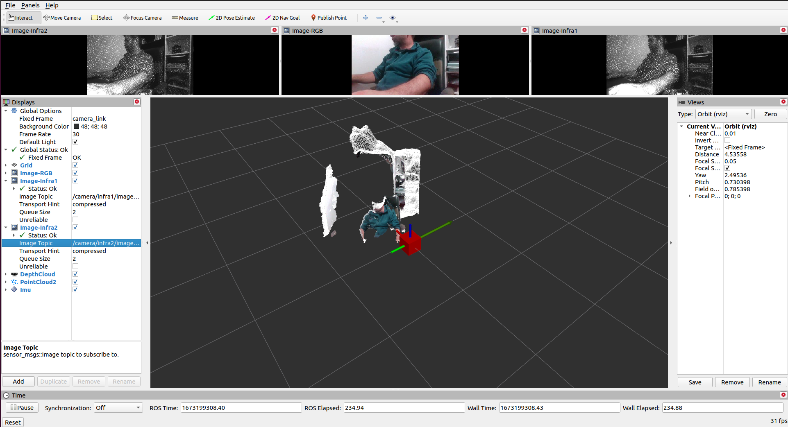

# Realsense D435i Installation for ROS Noetic on Ubuntu 18.04

In this tutorial I will describe the steps needed to fully install the Realsense D435i on the official Jetson Nano Ubuntu 18.04 distribution, with the latest Nvidia Jetpack installed based on a ROS Noetic deployment. If you don't have such a distribution installed, please complete the [Jetson Nano Ubuntu 18.04 Full Install](jetson-nano-ubuntu-18-04-install.md) and the [ROS Noetic Install on Jetson Nano with Ubuntu 18.04 (python3.6)](jetson-nano-ros-noetic-ubuntu-18-04-install.md) tutorials.

The tutorial assumes that the aforementioned installs are done, while it details the steps to properly install [librealsense](https://github.com/IntelRealSense/librealsense), [realsense-ros warpper](https://github.com/IntelRealSense/realsense-ros/tree/ros1-legacy) and the corresponding [realsense firmare](https://dev.intelrealsense.com/docs/firmware-releases).

Please note that the ROS Realsense warpper 2.3.2 that is compatible with ROS Noetic [2] requires librealsense version 2.50.0 [7]. While the recommaned Realsense D435i Ffirmware version is 5.13.0.50 [3].

## Librealsense Installation

1. Disconnect the Realsense USB cable from the Jetson Nano.
2. Make sure your Jetson is up to date

```bash
sudo apt-get update
sudo apt-get upgrade
```

3. Librealsense with CUDA 10.2 support requires us to build the library with version 8 for gcc and g++. If you followed [Jetson Nano Ubuntu 18.04 Full Install](ubuntu-18-04-install.md), you can simply select the versions by:

```bash
sudo update-alternatives --config gcc
```

```bash
[sudo] password for jetson:
There are 4 choices for the alternative gcc (providing /usr/bin/gcc).

  Selection    Path             Priority   Status
------------------------------------------------------------
* 0            /usr/bin/gcc-11   11        auto mode
  1            /usr/bin/gcc-10   10        manual mode
  2            /usr/bin/gcc-11   11        manual mode
  3            /usr/bin/gcc-7    7         manual mode
  4            /usr/bin/gcc-8    8         manual mode

Press <enter> to keep the current choice[*], or type selection number: 4
```

```bash
sudo update-alternatives --config g++
```

```bash
There are 4 choices for the alternative g++ (providing /usr/bin/g++).

  Selection    Path             Priority   Status
------------------------------------------------------------
* 0            /usr/bin/g++-11   11        auto mode
  1            /usr/bin/g++-10   10        manual mode
  2            /usr/bin/g++-11   11        manual mode
  3            /usr/bin/g++-7    7         manual mode
  4            /usr/bin/g++-8    8         manual mode

Press <enter> to keep the current choice[*], or type selection number: 4
```

4. Set the path for CUDA compiler by editing the `~/.bashrc` file:

```bash
nano ~/.bashrc
```

and append the following lines to the end of the file:

```bash
# cuda 10.2
export CUDA_HOME=/usr/local/cuda
export LD_LIBRARY_PATH=$LD_LIBRARY_PATH:/usr/local/cuda/lib64:/usr/local/cuda/extras/CUPTI/lib64
export PATH=$PATH:$CUDA_HOME/bin
```

then source the file:

```bash
source ~/.bashrc
```

5. Download the librealsense 2.50.0 realease and uzip the archive:

```bash
wget https://github.com/IntelRealSense/librealsense/archive/refs/tags/v2.50.0.zip

unzip v2.50.0.zip
```

6. Navigate to `librealsense-2.50.0`:

```bash
cd librealsense-2.50.0
```

7. You can try to run the L4T patch script, but it will fail since the latest jetpack is not supported. No worries, it will still work fine, aside from a warining in ROS from the realsense-ros warpper:

```bash
./scripts/patch-realsense-ubuntu-L4T.sh
```

```bash
The script patches and applies in-tree kernel modules required for Librealsense SDK

Remove all RealSense cameras attached. Hit any key when ready

[sudo] password for jetson:
Reading package lists... Done
Building dependency tree
Reading state information... Done
build-essential is already the newest version (12.4ubuntu1).
build-essential set to manually installed.
git is already the newest version (1:2.17.1-1ubuntu0.13).
0 upgraded, 0 newly installed, 0 to remove and 13 not upgraded.
200
Jetson Board (proc/device-tree/model): NVIDIA Jetson Nano 2GB Developer Kit
Jetson L4T version: 32.7.3
Unsupported JetPack revision 32.7.3 aborting script

```

8. Install the librealsense build prerequisites:

```bash
sudo apt-get install git libssl-dev libusb-1.0-0-dev libudev-dev pkg-config libgtk-3-dev -y
```

9. Install the udev Realsense access rules:

```bash
./scripts/setup_udev_rules.sh
```

10. Create a `build` directory and navigate to it:

```bash
mkdir build && cd build
```

11. Build and install librealsense:

```bash
cmake .. -DBUILD_EXAMPLES=true -DCMAKE_BUILD_TYPE=release -DFORCE_RSUSB_BACKEND=false -DBUILD_WITH_CUDA=true && make -j$(($(nproc)-1)) && sudo make install
```

## Realsense ROS Warpper Install

1. Make sure your Jetson is up to date

```bash
sudo apt-get update
sudo apt-get upgrade
```

2. Will be using gcc and g ++ version 10 to build the realsense-ros warpper. If your followed [Jetson Nano Ubuntu 18.04 Full Install](ubuntu-18-04-install.md) you can simply select them by:

```bash
sudo update-alternatives --config gcc
```

```bash
[sudo] password for jetson:
There are 4 choices for the alternative gcc (providing /usr/bin/gcc).

  Selection    Path             Priority   Status
------------------------------------------------------------
* 0            /usr/bin/gcc-11   11        auto mode
  1            /usr/bin/gcc-10   10        manual mode
  2            /usr/bin/gcc-11   11        manual mode
  3            /usr/bin/gcc-7    7         manual mode
  4            /usr/bin/gcc-8    8         manual mode

Press <enter> to keep the current choice[*], or type selection number: 1
```

```bash
sudo update-alternatives --config g++
```

```bash
There are 4 choices for the alternative g++ (providing /usr/bin/g++).

  Selection    Path             Priority   Status
------------------------------------------------------------
* 0            /usr/bin/g++-11   11        auto mode
  1            /usr/bin/g++-10   10        manual mode
  2            /usr/bin/g++-11   11        manual mode
  3            /usr/bin/g++-7    7         manual mode
  4            /usr/bin/g++-8    8         manual mode

Press <enter> to keep the current choice[*], or type selection number: 1
```

3. Create a catkin workspace and navigate into the source folder:

```bash
mkdir -p ~/catkin_ws/src
cd ~/catkin_ws/src/
```

4. Clone the `realsense-ros` repository:

```bash
git clone https://github.com/IntelRealSense/realsense-ros.git
```

5.  Clone the `ddynamic_reconfigure` repository:

```bash
git clone https://github.com/pal-robotics/ddynamic_reconfigure.git
```

6. We also need the `image_transport_plugins` to have the compressed streams available for the warpper. So, clone the `noetic-devel` branch from `ros-perception/image_transport_plugins`:

```bash
 git clone -b noetic-devel https://github.com/ros-perception/image_transport_plugins.git
```

7. Install the necesarry dependencies:

```bash
sudo apt-get install libturbojpeg libturbojpeg0-dev libogg0 libogg-dev libtheora0 libtheora-dev
```

8. Navigate into the `realsense-ros` package:

```bash
cd ~/catkin_ws/src/realsense-ros/
```

9. Checkout the realsense-ros compatible 2.3.2 verison:

```bash
git checkout tags/2.3.2 -b 2.3.2
```

10. Navigate to the catkin workspace source folder:

```bash
cd ~/catkin_ws/src
```
11. Initialize the catkin workspace:

```bash
catkin_init_workspace
```
12. Navigate to the catkin workspace:

```bash
cd ~/catkin_ws/
```

13. Clean the workspace to see if anything is missing before the build:

```bash
catkin_make clean
```

14. Build the packages in the catkin workspace:

```bash
catkin_make -DCATKIN_ENABLE_TESTING=False -DCMAKE_BUILD_TYPE=Release
```

15. Install the packages:

```bash
catkin_make install
```

16. Optionally add the catking workspace to `bashrc` such that it will be sourced on every loggin:

```bash
echo "source ~/catkin_ws/devel/setup.bash" >> ~/.bashrc
source ~/.bashrc
```

## Realsense Firmware Install
1. Make sure you have PC (x86_64) with Ubuntu 20.04 and Realsense properly installed.
2. Download the on the PC, the Realsense Firmware 5.13.0.50 for librealsense SDK 2.50.0 (see [3] for more details):
```bash
wget https://www.intelrealsense.com/download/19295/?_ga=2.152892921.1994987032.1673174169-2104036828.1672302692
```
3. Unzip the archive you just downloaded:
```bash
unzip D400_Series_FW_5_13_0_50.zip
```
4. Fire up `realsense-viewer`:
```bash
realsense-viewer
```
5. Connect the Realsense D435i to an USB3.2 of your PC
6. Close all the module streams (i.e Stero Module, RGB Camera and Motion Module)
7. Click on the "More" Icon for your Realsense, located in the menu on the lefthand side.
8. Select "Update Firmware" from the drop-down menu that appears.
9. Browse to the `D400_Series_FW_5_13_0_50` directory of the firmware file you unziped in step 3.
10. Select the `Signed_Image_UVC_5_13_0_50.bin` firmware and click "Ok".
11. Let the process finish, then your done here.


## Run Realsense ROS Warpper

1. If the all the steps above succeded, plug-in the Realsense into an USB 3.2 port of the Jetson Nano.
The `dmesg` command should output something similar to:

```bash
[23724.629063] usb 2-1: new SuperSpeed USB device number 4 using tegra-xusb
[23724.649677] usb 2-1: New USB device found, idVendor=8086, idProduct=0b3a
[23724.649682] usb 2-1: New USB device strings: Mfr=1, Product=2, SerialNumber=3
[23724.649686] usb 2-1: Product: Intel(R) RealSense(TM) Depth Camera 435i
[23724.649690] usb 2-1: Manufacturer: Intel(R) RealSense(TM) Depth Camera 435i
[23724.649693] usb 2-1: SerialNumber: 852323051376
[23724.651046] uvcvideo: Found UVC 1.50 device Intel(R) RealSense(TM) Depth Camera 435i (8086:0b3a)
[23724.652813] uvcvideo: Unable to create debugfs 2-4 directory.
[23724.652968] uvcvideo 2-1:1.0: Entity type for entity Intel(R) RealSense(TM) Depth Ca was not initialized!
[23724.662573] uvcvideo 2-1:1.0: Entity type for entity Processing 2 was not initialized!
[23724.670500] uvcvideo 2-1:1.0: Entity type for entity Camera 1 was not initialized!
[23724.678330] input: Intel(R) RealSense(TM) Depth Ca as /devices/70090000.xusb/usb2/2-1/2-1:1.0/input/input4
[23724.679278] uvcvideo: Found UVC 1.50 device Intel(R) RealSense(TM) Depth Camera 435i (8086:0b3a)
[23724.680091] uvcvideo: Unable to create debugfs 2-4 directory.
[23724.680213] uvcvideo 2-1:1.3: Entity type for entity Processing 7 was not initialized!
[23724.688158] uvcvideo 2-1:1.3: Entity type for entity Extension 8 was not initialized!
[23724.695997] uvcvideo 2-1:1.3: Entity type for entity Camera 6 was not initialized!
[23724.764771] hid-sensor-hub 0003:8086:0B3A.0003: No report with id 0xffffffff found
[23724.774434] hid-sensor-hub 0003:8086:0B3A.0003: No report with id 0xffffffff found
[23724.840776] hid-sensor-hub 0003:8086:0B3A.0003: No report with id 0xffffffff found
[23724.849703] hid-sensor-hub 0003:8086:0B3A.0003: No report with id 0xffffffff found
[23725.152760] hid-sensor-hub 0003:8086:0B3A.0003: No report with id 0xffffffff found
```

2. Launch the realsense-ros warpper with the following arguments:

```bash
roslaunch realsense2_camera rs_camera.launch depth_width:=424 depth_height:=240 depth_fps:=15 color_width:=320 color_height:=180 color_fps:=30 infra_width:=424 infra_height:=240 infra_fps:=15 filters:=pointcloud enable_infra1:=True enable_infra2:=True enable_gyro:=True enable_accel:=True align_depth:=True enable_sync:=True
```

the output shoud be similar to:

```bash
... logging to /home/jetson/.ros/log/5371089c-8f77-11ed-a3af-3460f9e7d9c6/roslaunch-nano-antrobot3-9581.log
Checking log directory for disk usage. This may take a while.
Press Ctrl-C to interrupt
Done checking log file disk usage. Usage is <1GB.

started roslaunch server http://nano-antrobot3:33435/

SUMMARY
========

PARAMETERS
 * /camera/realsense2_camera/accel_fps: -1
 * /camera/realsense2_camera/accel_frame_id: camera_accel_frame
 * /camera/realsense2_camera/accel_optical_frame_id: camera_accel_opti...
 * /camera/realsense2_camera/align_depth: True
 * /camera/realsense2_camera/aligned_depth_to_color_frame_id: camera_aligned_de...
 * /camera/realsense2_camera/aligned_depth_to_fisheye1_frame_id: camera_aligned_de...
 * /camera/realsense2_camera/aligned_depth_to_fisheye2_frame_id: camera_aligned_de...
 * /camera/realsense2_camera/aligned_depth_to_fisheye_frame_id: camera_aligned_de...
 * /camera/realsense2_camera/aligned_depth_to_infra1_frame_id: camera_aligned_de...
 * /camera/realsense2_camera/aligned_depth_to_infra2_frame_id: camera_aligned_de...
 * /camera/realsense2_camera/allow_no_texture_points: False
 * /camera/realsense2_camera/base_frame_id: camera_link
 * /camera/realsense2_camera/calib_odom_file:
 * /camera/realsense2_camera/clip_distance: -2.0
 * /camera/realsense2_camera/color_fps: 30
 * /camera/realsense2_camera/color_frame_id: camera_color_frame
 * /camera/realsense2_camera/color_height: 180
 * /camera/realsense2_camera/color_optical_frame_id: camera_color_opti...
 * /camera/realsense2_camera/color_width: 320
 * /camera/realsense2_camera/confidence_fps: -1
 * /camera/realsense2_camera/confidence_height: -1
 * /camera/realsense2_camera/confidence_width: -1
 * /camera/realsense2_camera/depth_fps: 15
 * /camera/realsense2_camera/depth_frame_id: camera_depth_frame
 * /camera/realsense2_camera/depth_height: 240
 * /camera/realsense2_camera/depth_optical_frame_id: camera_depth_opti...
 * /camera/realsense2_camera/depth_width: 424
 * /camera/realsense2_camera/device_type:
 * /camera/realsense2_camera/enable_accel: True
 * /camera/realsense2_camera/enable_color: True
 * /camera/realsense2_camera/enable_confidence: True
 * /camera/realsense2_camera/enable_depth: True
 * /camera/realsense2_camera/enable_fisheye1: False
 * /camera/realsense2_camera/enable_fisheye2: False
 * /camera/realsense2_camera/enable_fisheye: False
 * /camera/realsense2_camera/enable_gyro: True
 * /camera/realsense2_camera/enable_infra1: False
 * /camera/realsense2_camera/enable_infra2: False
 * /camera/realsense2_camera/enable_infra: True
 * /camera/realsense2_camera/enable_pointcloud: False
 * /camera/realsense2_camera/enable_pose: False
 * /camera/realsense2_camera/enable_sync: True
 * /camera/realsense2_camera/filters: pointcloud
 * /camera/realsense2_camera/fisheye1_frame_id: camera_fisheye1_f...
 * /camera/realsense2_camera/fisheye1_optical_frame_id: camera_fisheye1_o...
 * /camera/realsense2_camera/fisheye2_frame_id: camera_fisheye2_f...
 * /camera/realsense2_camera/fisheye2_optical_frame_id: camera_fisheye2_o...
 * /camera/realsense2_camera/fisheye_fps: -1
 * /camera/realsense2_camera/fisheye_frame_id: camera_fisheye_frame
 * /camera/realsense2_camera/fisheye_height: -1
 * /camera/realsense2_camera/fisheye_optical_frame_id: camera_fisheye_op...
 * /camera/realsense2_camera/fisheye_width: -1
 * /camera/realsense2_camera/gyro_fps: -1
 * /camera/realsense2_camera/gyro_frame_id: camera_gyro_frame
 * /camera/realsense2_camera/gyro_optical_frame_id: camera_gyro_optic...
 * /camera/realsense2_camera/imu_optical_frame_id: camera_imu_optica...
 * /camera/realsense2_camera/infra1_frame_id: camera_infra1_frame
 * /camera/realsense2_camera/infra1_optical_frame_id: camera_infra1_opt...
 * /camera/realsense2_camera/infra2_frame_id: camera_infra2_frame
 * /camera/realsense2_camera/infra2_optical_frame_id: camera_infra2_opt...
 * /camera/realsense2_camera/infra_fps: 15
 * /camera/realsense2_camera/infra_height: 240
 * /camera/realsense2_camera/infra_rgb: False
 * /camera/realsense2_camera/infra_width: 424
 * /camera/realsense2_camera/initial_reset: False
 * /camera/realsense2_camera/json_file_path:
 * /camera/realsense2_camera/linear_accel_cov: 0.01
 * /camera/realsense2_camera/odom_frame_id: camera_odom_frame
 * /camera/realsense2_camera/ordered_pc: False
 * /camera/realsense2_camera/pointcloud_texture_index: 0
 * /camera/realsense2_camera/pointcloud_texture_stream: RS2_STREAM_COLOR
 * /camera/realsense2_camera/pose_frame_id: camera_pose_frame
 * /camera/realsense2_camera/pose_optical_frame_id: camera_pose_optic...
 * /camera/realsense2_camera/publish_odom_tf: True
 * /camera/realsense2_camera/publish_tf: True
 * /camera/realsense2_camera/reconnect_timeout: 6.0
 * /camera/realsense2_camera/rosbag_filename:
 * /camera/realsense2_camera/serial_no:
 * /camera/realsense2_camera/stereo_module/exposure/1: 7500
 * /camera/realsense2_camera/stereo_module/exposure/2: 1
 * /camera/realsense2_camera/stereo_module/gain/1: 16
 * /camera/realsense2_camera/stereo_module/gain/2: 16
 * /camera/realsense2_camera/tf_publish_rate: 0.0
 * /camera/realsense2_camera/topic_odom_in: odom_in
 * /camera/realsense2_camera/unite_imu_method:
 * /camera/realsense2_camera/usb_port_id:
 * /camera/realsense2_camera/wait_for_device_timeout: -1.0
 * /rosdistro: noetic
 * /rosversion: 1.15.15

NODES
  /camera/
    realsense2_camera (nodelet/nodelet)
    realsense2_camera_manager (nodelet/nodelet)

auto-starting new master
process[master]: started with pid [9591]
ROS_MASTER_URI=http://localhost:11311

setting /run_id to 5371089c-8f77-11ed-a3af-3460f9e7d9c6
process[rosout-1]: started with pid [9604]
started core service [/rosout]
process[camera/realsense2_camera_manager-2]: started with pid [9621]
process[camera/realsense2_camera-3]: started with pid [9622]
[ INFO] [1673197820.386920889]: Initializing nodelet with 4 worker threads.
[ INFO] [1673197820.598877294]: RealSense ROS v2.3.2
[ INFO] [1673197820.598970786]: Built with LibRealSense v2.50.0
[ INFO] [1673197820.599037402]: Running with LibRealSense v2.50.0
[ INFO] [1673197820.651537873]:
[ INFO] [1673197820.667414976]: Device with serial number 843112071761 was found.

[ INFO] [1673197820.667532270]: Device with physical ID /sys/devices/70090000.xusb/usb2/2-1/2-1:1.0/video4linux/video0 was found.
[ INFO] [1673197820.667599876]: Device with name Intel RealSense D435I was found.
[ INFO] [1673197820.668688179]: Device with port number 2-1 was found.
[ INFO] [1673197820.668791880]: Device USB type: 3.2
[ INFO] [1673197820.682304349]: getParameters...
[ INFO] [1673197820.946129911]: setupDevice...
[ INFO] [1673197820.946221319]: JSON file is not provided
[ INFO] [1673197820.946287258]: ROS Node Namespace: camera
[ INFO] [1673197820.946372989]: Device Name: Intel RealSense D435I
[ INFO] [1673197820.946429865]: Device Serial No: 843112071761
[ INFO] [1673197820.946484189]: Device physical port: /sys/devices/70090000.xusb/usb2/2-1/2-1:1.0/video4linux/video0
[ INFO] [1673197820.946536065]: Device FW version: 05.13.00.50
[ INFO] [1673197820.946588983]: Device Product ID: 0x0B3A
[ INFO] [1673197820.946658099]: Enable PointCloud: On
[ INFO] [1673197820.946707527]: Align Depth: On
[ INFO] [1673197820.946757060]: Sync Mode: On
[ INFO] [1673197820.946885760]: Device Sensors:
[ INFO] [1673197820.957336760]: Stereo Module was found.
[ INFO] [1673197820.977268686]: RGB Camera was found.
[ INFO] [1673197820.977919013]: Motion Module was found.
[ INFO] [1673197820.978037192]: (Infrared, 0) sensor isn't supported by current device! -- Skipping...
[ INFO] [1673197820.978106881]: (Confidence, 0) sensor isn't supported by current device! -- Skipping...
[ INFO] [1673197820.978937211]: Add Filter: pointcloud
[ INFO] [1673197820.980422971]: num_filters: 2
[ INFO] [1673197820.980512296]: Setting Dynamic reconfig parameters.
[ WARN] [1673197821.142184995]: Param '/camera/rgb_camera/power_line_frequency' has value 3 that is not in the enum { {50Hz: 1} {60Hz: 2} {Disabled: 0} }. Removing this parameter from dynamic reconfigure options.
[ INFO] [1673197821.206801813]: Done Setting Dynamic reconfig parameters.
[ INFO] [1673197821.207679852]: depth stream is enabled - width: 424, height: 240, fps: 15, Format: Z16
[ INFO] [1673197821.208401742]: color stream is enabled - width: 320, height: 180, fps: 30, Format: RGB8
[ INFO] [1673197821.209274521]: gyro stream is enabled - fps: 200
[ INFO] [1673197821.209368586]: accel stream is enabled - fps: 63
[ INFO] [1673197821.209464421]: setupPublishers...
[ INFO] [1673197821.218529558]: Expected frequency for depth = 15.00000
[ INFO] [1673197821.349248382]: Expected frequency for color = 30.00000
[ INFO] [1673197821.464782045]: Expected frequency for aligned_depth_to_color = 30.00000
[ INFO] [1673197821.589860594]: setupStreams...
 08/01 19:10:21,593 WARNING [547638169984] (ds5-motion.cpp:473) IMU Calibration is not available, default intrinsic and extrinsic will be used.
[ INFO] [1673197821.667648781]: SELECTED BASE:Depth, 0
[ INFO] [1673197821.719563199]: RealSense Node Is Up!
[ WARN] [1673197821.723084157]:

```

Note that the:

```bash
[ WARN] [1673197821.142184995]: Param '/camera/rgb_camera/power_line_frequency' has value 3 that is not in the enum { {50Hz: 1} {60Hz: 2} {Disabled: 0} }. Removing this parameter from dynamic reconfigure options.
```

is due to the lack of a kernel patch.

3. Running `rostopic list` yiels the following:

```bash
/camera/accel/imu_info
/camera/accel/metadata
/camera/accel/sample
/camera/align_to_color/parameter_descriptions
/camera/align_to_color/parameter_updates
/camera/aligned_depth_to_color/camera_info
/camera/aligned_depth_to_color/image_raw
/camera/aligned_depth_to_color/image_raw/compressed
/camera/aligned_depth_to_color/image_raw/compressed/parameter_descriptions
/camera/aligned_depth_to_color/image_raw/compressed/parameter_updates
/camera/aligned_depth_to_color/image_raw/compressedDepth
/camera/aligned_depth_to_color/image_raw/compressedDepth/parameter_descriptions
/camera/aligned_depth_to_color/image_raw/compressedDepth/parameter_updates
/camera/aligned_depth_to_color/image_raw/theora
/camera/aligned_depth_to_color/image_raw/theora/parameter_descriptions
/camera/aligned_depth_to_color/image_raw/theora/parameter_updates
/camera/color/camera_info
/camera/color/image_raw
/camera/color/image_raw/compressed
/camera/color/image_raw/compressed/parameter_descriptions
/camera/color/image_raw/compressed/parameter_updates
/camera/color/image_raw/compressedDepth
/camera/color/image_raw/compressedDepth/parameter_descriptions
/camera/color/image_raw/compressedDepth/parameter_updates
/camera/color/image_raw/theora
/camera/color/image_raw/theora/parameter_descriptions
/camera/color/image_raw/theora/parameter_updates
/camera/color/metadata
/camera/depth/camera_info
/camera/depth/color/points
/camera/depth/image_rect_raw
/camera/depth/image_rect_raw/compressed
/camera/depth/image_rect_raw/compressed/parameter_descriptions
/camera/depth/image_rect_raw/compressed/parameter_updates
/camera/depth/image_rect_raw/compressedDepth
/camera/depth/image_rect_raw/compressedDepth/parameter_descriptions
/camera/depth/image_rect_raw/compressedDepth/parameter_updates
/camera/depth/image_rect_raw/theora
/camera/depth/image_rect_raw/theora/parameter_descriptions
/camera/depth/image_rect_raw/theora/parameter_updates
/camera/depth/metadata
/camera/extrinsics/depth_to_color
/camera/extrinsics/depth_to_infra1
/camera/extrinsics/depth_to_infra2
/camera/gyro/imu_info
/camera/gyro/metadata
/camera/gyro/sample
/camera/infra1/camera_info
/camera/infra1/image_rect_raw
/camera/infra1/image_rect_raw/compressed
/camera/infra1/image_rect_raw/compressed/parameter_descriptions
/camera/infra1/image_rect_raw/compressed/parameter_updates
/camera/infra1/image_rect_raw/compressedDepth
/camera/infra1/image_rect_raw/compressedDepth/parameter_descriptions
/camera/infra1/image_rect_raw/compressedDepth/parameter_updates
/camera/infra1/image_rect_raw/theora
/camera/infra1/image_rect_raw/theora/parameter_descriptions
/camera/infra1/image_rect_raw/theora/parameter_updates
/camera/infra1/metadata
/camera/infra2/camera_info
/camera/infra2/image_rect_raw
/camera/infra2/image_rect_raw/compressed
/camera/infra2/image_rect_raw/compressed/parameter_descriptions
/camera/infra2/image_rect_raw/compressed/parameter_updates
/camera/infra2/image_rect_raw/compressedDepth
/camera/infra2/image_rect_raw/compressedDepth/parameter_descriptions
/camera/infra2/image_rect_raw/compressedDepth/parameter_updates
/camera/infra2/image_rect_raw/theora
/camera/infra2/image_rect_raw/theora/parameter_descriptions
/camera/infra2/image_rect_raw/theora/parameter_updates
/camera/infra2/metadata
/camera/motion_module/parameter_descriptions
/camera/motion_module/parameter_updates
/camera/pointcloud/parameter_descriptions
/camera/pointcloud/parameter_updates
/camera/realsense2_camera_manager/bond
/camera/rgb_camera/auto_exposure_roi/parameter_descriptions
/camera/rgb_camera/auto_exposure_roi/parameter_updates
/camera/rgb_camera/parameter_descriptions
/camera/rgb_camera/parameter_updates
/camera/stereo_module/auto_exposure_roi/parameter_descriptions
/camera/stereo_module/auto_exposure_roi/parameter_updates
/camera/stereo_module/parameter_descriptions
/camera/stereo_module/parameter_updates
/diagnostics
/rosout
/rosout_agg
/tf
/tf_static
```

4. If you run rviz directly on the nano or you configure it to run in a multiple machine ROS environment, you should be able to get a result similar to the one in the image below:



5. That's it. It works!

## Realsense ROS Stream Resolution Configuration Options

To provide the configuration options when you launch the realsense warpper the argument format is as follows:

```bash
roslaunch realsense2_camera rs_camera.launch <stream-name>_width:=option <stream-name>_height:=option <stream-name>_fps:=option
```

For example to set the RGB camera color stream to run at 320x180 @ 30fps you can do the following:

```bash
roslaunch realsense2_camera rs_camera.launch color_width:=320 color_height:=180 color_fps:=30
```

### Infrared Stream

```bash
Infrared 2 1280x800 @ 30Hz Y8
Infrared 1 1280x800 @ 30Hz Y8
Infrared 1 1280x800 @ 25Hz Y16
Infrared 2 1280x800 @ 25Hz Y16
Infrared 2 1280x800 @ 15Hz Y16
Infrared 1 1280x800 @ 15Hz Y16
Infrared 1 1280x800 @ 15Hz Y8
Infrared 2 1280x800 @ 15Hz Y8
Infrared 1 1280x720 @ 30Hz Y8
Infrared 2 1280x720 @ 30Hz Y8
Infrared 2 1280x720 @ 15Hz Y8
Infrared 1 1280x720 @ 15Hz Y8
Infrared 1 1280x720 @ 6Hz Y8
Infrared 2 1280x720 @ 6Hz Y8
Infrared 2 848x480 @ 90Hz Y8
Infrared 1 848x480 @ 90Hz Y8
Infrared 2 848x480 @ 60Hz Y8
Infrared 1 848x480 @ 60Hz Y8
Infrared 2 848x480 @ 30Hz Y8
Infrared 1 848x480 @ 30Hz Y8
Infrared 2 848x480 @ 15Hz Y8
Infrared 1 848x480 @ 15Hz Y8
Infrared 2 848x480 @ 6Hz Y8
Infrared 1 848x480 @ 6Hz Y8
Infrared 2 640x480 @ 90Hz Y8
Infrared 1 640x480 @ 90Hz Y8
Infrared 2 640x480 @ 60Hz Y8
Infrared 1 640x480 @ 60Hz Y8
Infrared 1 640x480 @ 30Hz Y8
Infrared 2 640x480 @ 30Hz Y8
Infrared 1 640x480 @ 15Hz Y8
Infrared 2 640x480 @ 15Hz Y8
Infrared 2 640x480 @ 6Hz Y8
Infrared 1 640x480 @ 6Hz Y8
Infrared 1 640x400 @ 25Hz Y16
Infrared 2 640x400 @ 25Hz Y16
Infrared 1 640x400 @ 15Hz Y16
Infrared 2 640x400 @ 15Hz Y16
Infrared 2 640x360 @ 90Hz Y8
Infrared 1 640x360 @ 90Hz Y8
Infrared 1 640x360 @ 60Hz Y8
Infrared 2 640x360 @ 60Hz Y8
Infrared 1 640x360 @ 30Hz Y8
Infrared 2 640x360 @ 30Hz Y8
Infrared 2 640x360 @ 15Hz Y8
Infrared 1 640x360 @ 15Hz Y8
Infrared 1 640x360 @ 6Hz Y8
Infrared 2 640x360 @ 6Hz Y8
Infrared 2 480x270 @ 90Hz Y8
Infrared 1 480x270 @ 90Hz Y8
Infrared 1 480x270 @ 60Hz Y8
Infrared 2 480x270 @ 60Hz Y8
Infrared 1 480x270 @ 30Hz Y8
Infrared 2 480x270 @ 30Hz Y8
Infrared 2 480x270 @ 15Hz Y8
Infrared 1 480x270 @ 15Hz Y8
Infrared 1 480x270 @ 6Hz Y8
Infrared 2 480x270 @ 6Hz Y8
Infrared 1 424x240 @ 90Hz Y8
Infrared 2 424x240 @ 90Hz Y8
Infrared 2 424x240 @ 60Hz Y8
Infrared 1 424x240 @ 60Hz Y8
Infrared 2 424x240 @ 30Hz Y8
Infrared 1 424x240 @ 30Hz Y8
Infrared 1 424x240 @ 15Hz Y8
Infrared 2 424x240 @ 15Hz Y8
Infrared 2 424x240 @ 6Hz Y8
Infrared 1 424x240 @ 6Hz Y8
```

### Depth Stream

```bash
Depth 1280x720 @ 30Hz Z16
Depth 1280x720 @ 15Hz Z16
Depth 1280x720 @ 6Hz Z16
Depth 848x480 @ 90Hz Z16
Depth 848x480 @ 60Hz Z16
Depth 848x480 @ 30Hz Z16
Depth 848x480 @ 15Hz Z16
Depth 848x480 @ 6Hz Z16
Depth 640x480 @ 90Hz Z16
Depth 640x480 @ 60Hz Z16
Depth 640x480 @ 30Hz Z16
Depth 640x480 @ 15Hz Z16
Depth 640x480 @ 6Hz Z16
Depth 640x360 @ 90Hz Z16
Depth 640x360 @ 60Hz Z16
Depth 640x360 @ 30Hz Z16
Depth 640x360 @ 15Hz Z16
Depth 640x360 @ 6Hz Z16
Depth 480x270 @ 90Hz Z16
Depth 480x270 @ 60Hz Z16
Depth 480x270 @ 30Hz Z16
Depth 480x270 @ 15Hz Z16
Depth 480x270 @ 6Hz Z16
Depth 424x240 @ 90Hz Z16
Depth 424x240 @ 60Hz Z16
Depth 424x240 @ 30Hz Z16
Depth 424x240 @ 15Hz Z16
Depth 424x240 @ 6Hz Z16
```

### Color Stream

```bash
Color 1920x1080 @ 30Hz RGB8
Color 1920x1080 @ 30Hz RAW16
Color 1920x1080 @ 30Hz Y16
Color 1920x1080 @ 30Hz BGRA8
Color 1920x1080 @ 30Hz RGBA8
Color 1920x1080 @ 30Hz BGR8
Color 1920x1080 @ 30Hz YUYV
Color 1920x1080 @ 15Hz RGB8
Color 1920x1080 @ 15Hz Y16
Color 1920x1080 @ 15Hz BGRA8
Color 1920x1080 @ 15Hz RGBA8
Color 1920x1080 @ 15Hz BGR8
Color 1920x1080 @ 15Hz YUYV
Color 1920x1080 @ 6Hz RGB8
Color 1920x1080 @ 6Hz Y16
Color 1920x1080 @ 6Hz BGRA8
Color 1920x1080 @ 6Hz RGBA8
Color 1920x1080 @ 6Hz BGR8
Color 1920x1080 @ 6Hz YUYV
Color 1280x720 @ 30Hz RGB8
Color 1280x720 @ 30Hz Y16
Color 1280x720 @ 30Hz BGRA8
Color 1280x720 @ 30Hz RGBA8
Color 1280x720 @ 30Hz BGR8
Color 1280x720 @ 30Hz YUYV
Color 1280x720 @ 15Hz RGB8
Color 1280x720 @ 15Hz Y16
Color 1280x720 @ 15Hz BGRA8
Color 1280x720 @ 15Hz RGBA8
Color 1280x720 @ 15Hz BGR8
Color 1280x720 @ 15Hz YUYV
Color 1280x720 @ 6Hz RGB8
Color 1280x720 @ 6Hz Y16
Color 1280x720 @ 6Hz BGRA8
Color 1280x720 @ 6Hz RGBA8
Color 1280x720 @ 6Hz BGR8
Color 1280x720 @ 6Hz YUYV
Color 960x540 @ 60Hz RGB8
Color 960x540 @ 60Hz Y16
Color 960x540 @ 60Hz BGRA8
Color 960x540 @ 60Hz RGBA8
Color 960x540 @ 60Hz BGR8
Color 960x540 @ 60Hz YUYV
Color 960x540 @ 30Hz RGB8
Color 960x540 @ 30Hz Y16
Color 960x540 @ 30Hz BGRA8
Color 960x540 @ 30Hz RGBA8
Color 960x540 @ 30Hz BGR8
Color 960x540 @ 30Hz YUYV
Color 960x540 @ 15Hz RGB8
Color 960x540 @ 15Hz Y16
Color 960x540 @ 15Hz BGRA8
Color 960x540 @ 15Hz RGBA8
Color 960x540 @ 15Hz BGR8
Color 960x540 @ 15Hz YUYV
Color 960x540 @ 6Hz RGB8
Color 960x540 @ 6Hz Y16
Color 960x540 @ 6Hz BGRA8
Color 960x540 @ 6Hz RGBA8
Color 960x540 @ 6Hz BGR8
Color 960x540 @ 6Hz YUYV
Color 848x480 @ 60Hz RGB8
Color 848x480 @ 60Hz Y16
Color 848x480 @ 60Hz BGRA8
Color 848x480 @ 60Hz RGBA8
Color 848x480 @ 60Hz BGR8
Color 848x480 @ 60Hz YUYV
Color 848x480 @ 30Hz RGB8
Color 848x480 @ 30Hz Y16
Color 848x480 @ 30Hz BGRA8
Color 848x480 @ 30Hz RGBA8
Color 848x480 @ 30Hz BGR8
Color 848x480 @ 30Hz YUYV
Color 848x480 @ 15Hz RGB8
Color 848x480 @ 15Hz Y16
Color 848x480 @ 15Hz BGRA8
Color 848x480 @ 15Hz RGBA8
Color 848x480 @ 15Hz BGR8
Color 848x480 @ 15Hz YUYV
Color 848x480 @ 6Hz RGB8
Color 848x480 @ 6Hz Y16
Color 848x480 @ 6Hz BGRA8
Color 848x480 @ 6Hz RGBA8
Color 848x480 @ 6Hz BGR8
Color 848x480 @ 6Hz YUYV
Color 640x480 @ 60Hz RGB8
Color 640x480 @ 60Hz Y16
Color 640x480 @ 60Hz BGRA8
Color 640x480 @ 60Hz RGBA8
Color 640x480 @ 60Hz BGR8
Color 640x480 @ 60Hz YUYV
Color 640x480 @ 30Hz RGB8
Color 640x480 @ 30Hz Y16
Color 640x480 @ 30Hz BGRA8
Color 640x480 @ 30Hz RGBA8
Color 640x480 @ 30Hz BGR8
Color 640x480 @ 30Hz YUYV
Color 640x480 @ 15Hz RGB8
Color 640x480 @ 15Hz Y16
Color 640x480 @ 15Hz BGRA8
Color 640x480 @ 15Hz RGBA8
Color 640x480 @ 15Hz BGR8
Color 640x480 @ 15Hz YUYV
Color 640x480 @ 6Hz RGB8
Color 640x480 @ 6Hz Y16
Color 640x480 @ 6Hz BGRA8
Color 640x480 @ 6Hz RGBA8
Color 640x480 @ 6Hz BGR8
Color 640x480 @ 6Hz YUYV
Color 640x360 @ 60Hz RGB8
Color 640x360 @ 60Hz Y16
Color 640x360 @ 60Hz BGRA8
Color 640x360 @ 60Hz RGBA8
Color 640x360 @ 60Hz BGR8
Color 640x360 @ 60Hz YUYV
Color 640x360 @ 30Hz RGB8
Color 640x360 @ 30Hz Y16
Color 640x360 @ 30Hz BGRA8
Color 640x360 @ 30Hz RGBA8
Color 640x360 @ 30Hz BGR8
Color 640x360 @ 30Hz YUYV
Color 640x360 @ 15Hz RGB8
Color 640x360 @ 15Hz Y16
Color 640x360 @ 15Hz BGRA8
Color 640x360 @ 15Hz RGBA8
Color 640x360 @ 15Hz BGR8
Color 640x360 @ 15Hz YUYV
Color 640x360 @ 6Hz RGB8
Color 640x360 @ 6Hz Y16
Color 640x360 @ 6Hz BGRA8
Color 640x360 @ 6Hz RGBA8
Color 640x360 @ 6Hz BGR8
Color 640x360 @ 6Hz YUYV
Color 424x240 @ 60Hz RGB8
Color 424x240 @ 60Hz Y16
Color 424x240 @ 60Hz BGRA8
Color 424x240 @ 60Hz RGBA8
Color 424x240 @ 60Hz BGR8
Color 424x240 @ 60Hz YUYV
Color 424x240 @ 30Hz RGB8
Color 424x240 @ 30Hz Y16
Color 424x240 @ 30Hz BGRA8
Color 424x240 @ 30Hz RGBA8
Color 424x240 @ 30Hz BGR8
Color 424x240 @ 30Hz YUYV
Color 424x240 @ 15Hz RGB8
Color 424x240 @ 15Hz Y16
Color 424x240 @ 15Hz BGRA8
Color 424x240 @ 15Hz RGBA8
Color 424x240 @ 15Hz BGR8
Color 424x240 @ 15Hz YUYV
Color 424x240 @ 6Hz RGB8
Color 424x240 @ 6Hz Y16
Color 424x240 @ 6Hz BGRA8
Color 424x240 @ 6Hz RGBA8
Color 424x240 @ 6Hz BGR8
Color 424x240 @ 6Hz YUYV
Color 320x240 @ 60Hz RGB8
Color 320x240 @ 60Hz Y16
Color 320x240 @ 60Hz BGRA8
Color 320x240 @ 60Hz RGBA8
Color 320x240 @ 60Hz BGR8
Color 320x240 @ 60Hz YUYV
Color 320x240 @ 30Hz RGB8
Color 320x240 @ 30Hz Y16
Color 320x240 @ 30Hz BGRA8
Color 320x240 @ 30Hz RGBA8
Color 320x240 @ 30Hz BGR8
Color 320x240 @ 30Hz YUYV
Color 320x240 @ 6Hz RGB8
Color 320x240 @ 6Hz Y16
Color 320x240 @ 6Hz BGRA8
Color 320x240 @ 6Hz RGBA8
Color 320x240 @ 6Hz BGR8
Color 320x240 @ 6Hz YUYV
Color 320x180 @ 60Hz RGB8
Color 320x180 @ 60Hz Y16
Color 320x180 @ 60Hz BGRA8
Color 320x180 @ 60Hz RGBA8
Color 320x180 @ 60Hz BGR8
Color 320x180 @ 60Hz YUYV
Color 320x180 @ 30Hz RGB8
Color 320x180 @ 30Hz Y16
Color 320x180 @ 30Hz BGRA8
Color 320x180 @ 30Hz RGBA8
Color 320x180 @ 30Hz BGR8
Color 320x180 @ 30Hz YUYV
Color 320x180 @ 6Hz RGB8
Color 320x180 @ 6Hz Y16
Color 320x180 @ 6Hz BGRA8
Color 320x180 @ 6Hz RGBA8
Color 320x180 @ 6Hz BGR8
Color 320x180 @ 6Hz YUYV
```

## Notes
1. At this time for jetpacks above 4.4.1 there is no librealsense linux kernel patch. While the realsense will function as expected, you may receive some warnings when luanching the realsense ros warpper node.
2. gcc, g++, clang version 8 and 9 contain a bug regarnding aarch64 architectures, see [8-10] for more details.

## References

1. [Librealsense NVidia Jetson Devices](https://github.com/IntelRealSense/librealsense/blob/master/doc/installation_jetson.md)
2. [ROS Wrapper for Intel® RealSense™ Devices](https://github.com/IntelRealSense/realsense-ros/tree/ros1-legacy#ros-wrapper-for-intel-realsense-devices)
3. [Firmware releases D400](https://dev.intelrealsense.com/docs/firmware-releases)
4. [ddynamic_reconfigure package](https://github.com/pal-robotics/ddynamic_reconfigure/tree/kinetic-devel#ddynamic_reconfigure)
5. [image_transport_plugins](https://github.com/ros-perception/image_transport_plugins/tree/noetic-devel)
6. [Different Resolution for depth and color stream to make camera working](https://github.com/IntelRealSense/librealsense/issues/3376)
7. [Librealsense releases](https://github.com/IntelRealSense/librealsense/releases)
8. [gcc 9: aarch64 -ftree-loop-vectorize results in wrong code](https://gcc.gnu.org/bugzilla//show_bug.cgi?id=102435)
9. [Issue ROS crash on Raspberry Pi 4B with a very simple program](https://github.com/ros/ros_comm/issues/2197)
10. [Demo ROS crash on Raspberry Pi 4B with a very simple program](https://github.com/AutoxingTech/simple_publisher_crash)
